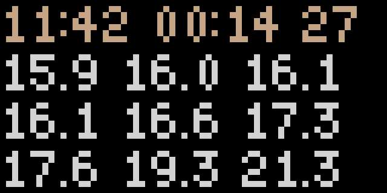

# Shibyt 

Shibby free Tidbyt for lofi MacOS backgrounds 

.

## What

Scripts to generate a regularly-updating lofi MacOS background 
using Tidbyt APIs to reproduce the experience and aesthetic
of odd, constrained APIs and hardware.

> Mac-only, but it is probably easy to update the script to work for Linux and Windows

## Why

Constraints and lack of utility and quality can be freeing.

## set up

- [Install the `px` library](https://tidbyt.dev/docs/build/installing-pixlet)
- `cd $PATH_TO_THIS_REPO && cp config.sample.sh config.sh` and edit keys
- update the absolute paths in script.sh
- `sudo crontab -e $(whoami)` and paste and edit `*/1 * * * * $ABSOLUTE_PATH_TO_SCRIPT.SH_GOES_HERE`

## try it out

`./script.sh && open ./one.webp`, but use the crontab stuff in the "config" section above to auto-update

## lint

pixlet lint main.star --fix

## Resources:

APIs:
- https://tidbyt.dev/docs/reference/widgets
- https://tidbyt.dev/docs/reference/modules
- and a subset of https://github.com/qri-io/starlib

Starlark language (Python--):
- https://bazel.build/rules/language

